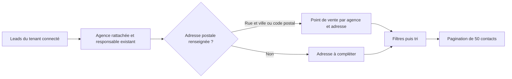

# Classement des leads par agence et point de vente

La liste `/app/leads` permet de retrouver les contacts par agence, responsable d’agence, point de vente, commercial chargé du suivi, source et statut. Le tri par défaut est agence, adresse, responsable puis contact. La recherche couvre aussi les noms, emails, téléphones, villes et adresses.

| Élément | Comportement |
| --- | --- |
| Agence | Nom de l’organisation rattachée. Regroupement visuel des variantes de casse, accents et espaces. Les fiches ne sont pas fusionnées. |
| Responsable d’agence | Champ responsable existant, puis contact principal suivant la règle déjà utilisée dans le CRM. Distinct du commercial chargé du suivi. |
| Point de vente | Clé composée du nom d’agence et de son adresse normalisée. Deux adresses différentes, même dans la même ville ou sous le même responsable, restent distinctes. |
| Adresse inconnue | Une ville ou un secteur seuls ne créent pas de point de vente. Filtre « Adresse à compléter ». |
| Contacts sans agence | Conservés dans la liste, filtre « Agence à rattacher ». |
| Navigation | Suppression de la limite silencieuse de 200 leads. Filtrage et tri avant pagination. Filtres conservés dans les liens de pagination. |
| Indicateurs et rappels | Calculés sur toute la sélection filtrée, y compris les autres pages. Le bouton d’assignation garde sa portée globale existante. |

## Données du fichier fourni

Lecture du fichier `users_MLS_Côte_d_Azur (1).xlsx` le 20 septembre 2026 :

- `Users MLS Côte dAzur` : 2 337 lignes non vides hors en-tête.
- `Dirigeant` : 583 lignes non vides hors en-tête.
- `Collaborateurs` : 1 746 lignes non vides hors en-tête.
- 459 noms d’agences distincts après normalisation sur les trois onglets.
- Les onglets se recouvrent : leur somme ne représente pas un nombre de personnes uniques.
- Les colonnes fournies sont agence, prénom, nom, email, mobile, ville/secteur et fonction. Aucune adresse postale n’est fournie.

Le classement utilise les rattachements et adresses déjà enregistrés dans le CRM. Le fichier n’a pas été réimporté, et aucune donnée de production n’a été modifiée. Aucun module d’import MLS dédié n’a été trouvé dans la branche principale inspectée. Les contacts dont l’agence n’est présente que dans des notes doivent être rattachés explicitement à une organisation pour bénéficier du filtre agence.

## Préservation et sécurité

Aucune migration et aucun changement de statut. Aucun paiement, document ou historique modifié. Aucun envoi d’email, de SMS ou d’appel. Les nouvelles lectures restent authentifiées et limitées au tenant connecté ; une organisation accidentellement rattachée à un autre tenant n’est pas affichée. Cette évolution ne crée pas d’accès partenaire MLS.

Le regroupement est une vue calculée, sans écriture en base et sans modification du responsable ou du signataire. Son retrait ne nécessite aucune reprise de données. Les adresses inconnues restent visibles plutôt que remplacées par une adresse supposée. Les erreurs de chargement empruntent la gestion d’erreur existante du CRM.

## Validation

- 60 tests réussis : classement (17), rendu de la liste (7), fiche lead (8), responsable d’organisation (19), actions leads existantes (9).
- Cas couverts : plusieurs adresses d’une agence, variantes d’écriture, compléments et numéros bis distincts, adresse manquante, filtres combinés, résultat situé après les 200 premières lignes, pagination, rappel hors de la première page, absence de session et rattachement incohérent entre tenants.
- Vérification TypeScript réussie après génération du client Prisma correspondant au schéma courant.
- ESLint ciblé sans erreur ni avertissement.
- Aperçus ordinateur et mobile contrôlés avec des données fictives. Tableau défilable horizontalement sur mobile.

## Limites et mise en service

La fonctionnalité est préparée dans la branche `feat/mls-agences-points-de-vente` et n’est pas déployée. Les tests ne constituent pas une vérification du contenu de la base de production.

Le modèle existant stocke une adresse par fiche d’organisation. La vue peut regrouper plusieurs fiches portant le même nom d’agence et distinguer leurs adresses ; elle ne crée pas un nouveau registre d’établissements. Une même adresse saisie avec des abréviations différentes n’est pas rapprochée approximativement. Aucun géocodage ni enrichissement externe n’est effectué.

La projection nécessaire au classement est chargée côté serveur pour l’ensemble des leads du tenant ; seuls 50 résultats sont rendus par page. Cette approche convient au volume MLS fourni. Pour une base de plusieurs dizaines de milliers de leads, il faudra déplacer les clés de classement et la pagination en base. Aucun coût Make ou appel d’API externe n’est ajouté.
