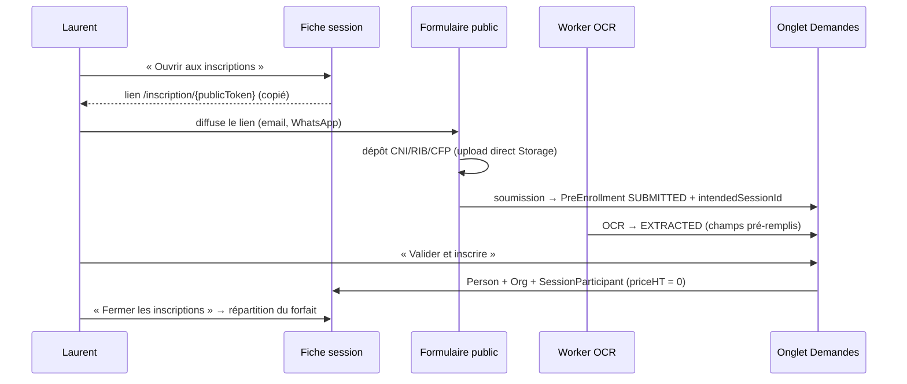

# Inscriptions publiques par session — design

**Date** : 2026-08-28
**Statut** : validé par Laurent, prêt à planifier
**Origine** : équivalent de la fonction « ouvrir la session aux inscriptions » de SmartOF
**Dépendance** : à exécuter **après** la Phase 22 (bascule prod + RGPD) — le formulaire est exposé sur Internet, l'URL doit être définitive et le traitement inscrit au registre RGPD.

---

## 1. Besoin

Laurent veut, depuis la fiche d'une session, générer un lien partageable que les futurs
apprenants remplissent eux-mêmes : identité, coordonnées, entreprise, et dépôt des trois
pièces (CNI, RIB, attestation CFP). Objectif métier : **savoir qui s'inscrit sur quelle
session en temps réel**, et supprimer la ressaisie administrative.

Aujourd'hui QualiOF a déjà le formulaire public, l'OCR et l'écran de validation, mais le
lien public n'est rattaché à **aucune session** : les demandes arrivent dans un pot commun
et la validation ne crée pas l'inscription.

## 2. Existant réutilisé (vérifié dans le code, 2026-08-28)

| Brique | Emplacement | Réutilisation |
|---|---|---|
| Formulaire public + 3 slots de dépôt | `components/preinscriptions/public-form.tsx` | étendu (champs + en-tête) |
| Upload direct navigateur → Storage (signed URL) | `components/shared/direct-upload-field.tsx`, `lib/storage.ts:createSignedUploadUrl` | réutilisé tel quel |
| Confirmation de dépôt côté public | `server/actions/storage-upload.ts:confirmPreEnrollmentUpload` | sert de modèle à la nouvelle action |
| Pipeline OCR | `scripts/preinscription-ocr-worker.ts` + `lib/preinscription-ocr-queue.ts` | **aucune modification** : le worker poll `status = 'SUBMITTED'`, il prendra les nouvelles demandes automatiquement |
| Validation → apprenant | `server/actions/preinscription-convert.ts:convertPreEnrollment` | étendu (crée l'inscription) |
| Rattachement session | `PreEnrollment.intendedSessionId` ↔ `TrainingSession.preEnrollments` | déjà au schéma, enfin alimenté |
| Statut « ouverte aux inscriptions » | `enum SessionStatus.OPEN` | réutilisé |
| Relances email des dossiers non finalisés | cron `preinscription-reminders` | inchangé |

`convertPreEnrollment` accepte **déjà** `birthName`, `socialSecurityNb` (rangé dans
`SensitiveData`), `eiSiret`, `eiLegalName`, `eiAddress`/`eiPostalCode`/`eiCity`. Les champs
SmartOF manquent uniquement côté **public**.

## 3. Périmètre

**Dans le périmètre**
- Un lien public permanent et révocable par session.
- Formulaire contextualisé (titre du produit, dates, lieu) avec les champs SmartOF.
- Suivi des demandes depuis la fiche session.
- Validation en un geste : apprenant créé **et** inscrit à la session.

**Hors périmètre (assumé)**
- Paiement en ligne, signature électronique à l'inscription.
- Toute tarification : collecte, calcul ou répartition de prix (cf. §6.2).
- Liste d'attente au-delà de `capacityMax` (le formulaire se ferme, point).
- Auto-assignation commerciale des demandes (voir `project_lead_distribution`).
- Portail apprenant avec compte et mot de passe.

## 4. Modèle de données

### 4.1 `TrainingSession` — 3 colonnes

```prisma
publicToken        String?   @unique  // jeton aléatoire 32 hex, null tant que jamais ouvert
publicFormOpenedAt DateTime?          // dernière ouverture
publicFormClosedAt DateTime?          // fermeture manuelle ; null = ouvert
```

Le lien est **ouvert** si `publicToken != null && publicFormClosedAt == null`.
Régénérer le jeton (bouton « Révoquer le lien ») invalide l'ancien immédiatement.

### 4.2 `PreEnrollment` — 6 colonnes

```prisma
birthName     String?
address       String?   // n° et rue
city          String?
postalCode    String?
companyName   String?
companySiret  String?
managerSince  String?   // « Dirigeant d'entreprise depuis » — libellé libre, ex. « 2019 »
```

**Le n° de sécurité sociale n'est pas ajouté ici.** Il est saisi au formulaire, transporté
en clair uniquement dans l'appel de soumission, et écrit **directement** dans
`SensitiveData.socialSecurityNb` au moment de la validation. Tant que la demande n'est pas
validée, le numéro n'est pas conservé — c'est la minimisation RGPD, et ça évite d'avoir une
table publique qui contient de la donnée sensible.

> Conséquence assumée : si l'admin rejette la demande, le n° de sécu est perdu. C'est le
> comportement voulu.

Migration Prisma : `prisma migrate dev` en local puis **`prisma migrate deploy` sur le cloud**
(cf. `feedback_prisma_migrate_deploy`). Aucune colonne obligatoire, aucun backfill.

## 5. Parcours



### 5.1 Route publique `/inscription/[token]`

Nouvelle route, **sœur** de `/preinscription/[token]` (qui reste en place pour les liens
individuels envoyés à la main).

Elle résout la session par `publicToken` et affiche, dans l'en-tête du formulaire :
le titre du produit, les dates (`Du 28 août 2026 au 30 octobre 2027`) et le lieu formaté
via `lib/locations/format-lieu.ts` — **la seule source de composition du lieu autorisée**
(cf. `feedback_source_unique_composition_lieu`, refus AGEFICE du 28/08/2026).

Quatre états d'affichage :

| Condition | Écran |
|---|---|
| Jeton inconnu | 404 |
| `publicFormClosedAt != null` | « Les inscriptions pour cette session sont closes » |
| `session.status` ∈ {COMPLETED, CANCELLED} | même écran de clôture |
| Inscrits + demandes en cours ≥ `capacityMax` | « Session complète » |
| Sinon | formulaire |

### 5.2 Aucune écriture avant la soumission

C'est le correctif du défaut actuel de `/preinscription`, qui crée une ligne en base **à
chaque visite** : un lien diffusé largement remplit la table de dossiers vides.

Le nouveau flux s'appuie sur un `draftId` (UUID généré côté navigateur) :

1. `createSessionEnrollmentUploadUrl(publicToken, draftId, kind, ext)` — vérifie que le lien
   est ouvert, renvoie une URL signée vers
   `preinscriptions/sessions/{sessionId}/{draftId}/{kind}-{stamp}.{ext}`.
2. Le navigateur téléverse en direct (aucun octet ne transite par le serveur Next — c'est ce
   qui permet d'accepter des pièces de 9 Mo malgré le plafond de 4,5 Mo par requête de
   Vercel).
3. `submitSessionEnrollmentRequest(publicToken, draftId, keys, fields)` crée la
   `PreEnrollment` en statut `SUBMITTED`, avec `intendedSessionId`, son propre `token`
   généré serveur, et `expiresAt = session.endDate + 30 j`.

Les fichiers de brouillons abandonnés restent orphelins dans le bucket : script
`scripts/purge-orphan-drafts.ts`, exécuté à la demande, supprime tout préfixe
`sessions/{sessionId}/{draftId}/` de plus de 30 jours auquel ne correspond aucune
`PreEnrollment`.

### 5.3 Fiche session

Sur l'onglet existant qui porte les participants (`app/app/sessions/[id]/`) :

- Un bloc **« Inscriptions en ligne »** : bouton `Ouvrir aux inscriptions` / champ lien en
  lecture seule + `Copier` / `Fermer les inscriptions` / `Révoquer le lien`.
- Un compteur : `3 demandes · 1 à traiter · 7 places restantes`.
- Une section **« Demandes d'inscription »** listant les `PreEnrollment` de la session :
  nom, date de dépôt, statut du pipeline, pièces reçues, et l'action `Valider et inscrire`.

L'écran global `/app/inscriptions` reste la vue transverse ; il gagne une colonne « Session ».

## 6. Règles métier

### 6.1 Qui paye — `sponsorOrgId`

`SessionParticipant.sponsorOrgId` est obligatoire : c'est l'organisation qui figure sur la
convention et sur la facture. Elle est déduite du statut professionnel déclaré :

| Statut déclaré | Organisation payeuse | Comportement |
|---|---|---|
| Agent commercial (auto-entrepreneur) | son EI | `convertPreEnrollment` la crée déjà (`createEiOrg`), avec le SIRET saisi |
| Dirigeant d'entreprise | l'entreprise du SIRET saisi | recherche par SIRET ; création si absente, `legalForm` à confirmer par l'admin |
| Salarié | l'enseigne du SIRET saisi | recherche par SIRET **uniquement** ; si aucune correspondance → **pas de création automatique** |

Quand le payeur ne peut pas être déterminé sans ambiguïté, la validation **s'arrête** et
affiche « payeur à confirmer » avec un sélecteur d'organisation. On ne crée jamais une
entreprise en doublon à partir d'un formulaire public : c'est exactement le mécanisme qui
noie un CRM d'organisations fantômes, et le pilier n°3 du produit consiste à l'éviter.

Rappel de la règle : *auto-entrepreneur → il paye lui-même ; salarié → sa structure paye*
(`feedback_regle_payeur`). Le cas agent commercial immobilier reste **deux LegalLinks** :
`EI_SELF` sur son EI, et le rattachement à l'enseigne (`feedback_pattern_agent_commercial`).

### 6.2 Le prix — hors périmètre

Le formulaire public ne collecte aucun prix, et la validation n'en calcule aucun : la
tarification se pilote depuis la fiche session, comme pour toute inscription
(`EditParticipantButton`, qui édite déjà `priceHT` par participant).

L'inscription issue du lien public naît donc à `priceHT = 0`, et le participant est signalé
dans la liste par la mention **« tarif à saisir »** pour qu'aucune facture ne parte à zéro
par inadvertance.

Rappel de la règle qui s'applique au moment de cette saisie, inchangée : le tarif est un
**forfait par entreprise** (2 500 € sous 10 salariés, 4 500 € au-delà) réparti entre ses
inscrits, jamais un prix par apprenant (`feedback_tarif_forfait_entreprise`).

### 6.3 Les documents Qualiopi

`prepareSession` génère convention, convocation et analyse des besoins à la création de la
session. Un inscrit arrivé plus tard doit obtenir ses documents : la validation appelle
`prepareTrainingForSession` pour ce seul participant. La fonction est *find-or-create*,
donc rejouable sans risque de doublon.

Conséquence sur la convention : une personne morale qui paye implique **une convention
groupe par entreprise**, pas une par apprenant (`feedback_contrat_vs_convention_payeur`).
Une inscription tardive dans une entreprise déjà conventionnée doit donc **régénérer** la
convention de cette entreprise, pas en créer une seconde.

### 6.4 Doublons de personnes

`convertPreEnrollment` cherche déjà une `Person` existante par email et la réutilise.
Ajout : si cette personne est **déjà inscrite** à la session
(`@@unique([sessionId, personId])`), la validation affiche « déjà inscrit à cette session »
et propose de rattacher la demande à l'inscription existante — les pièces déposées sont
alors rattachées à la personne connue, sans créer de seconde inscription.

## 7. Sécurité et RGPD

- **Jeton** : 32 caractères hexadécimaux aléatoires (`randomUUID()` sans tirets, comme
  l'existant), sans lien avec le code session — pas d'énumération possible.
- **Révocation** : la régénération invalide l'ancien lien sur-le-champ.
- **Aucune authentification** sur les actions publiques : la validation passe par le jeton
  de session, jamais par `validateRequest()` — même règle que
  `createPreEnrollmentUploadUrl` aujourd'hui.
- **Clé de service Storage jamais exposée** : seule l'URL signée part au navigateur.
- **Donnée sensible** : n° de sécu → `SensitiveData` uniquement, à la validation.
  Pièces (CNI, RIB) → bucket privé, accès par URL signée.
- **Consentement** : case RGPD obligatoire (déjà en place) + mention d'information
  précisant la finalité, la durée de conservation et le responsable de traitement.
- **Registre des traitements** : le formulaire collecte des données d'identité, une
  coordonnée bancaire et un numéro de sécurité sociale. Ce traitement doit être ajouté au
  registre produit en Phase 22 (`docs/rgpd/`), avec sa finalité, sa base légale (exécution
  du contrat de formation) et sa durée de conservation.
- **Rate limiting** : au maximum 5 soumissions par heure et par adresse IP sur
  `submitSessionEnrollmentRequest`, réponse générique en cas de dépassement.

## 8. Erreurs et cas limites

| Cas | Comportement |
|---|---|
| Jeton inconnu / révoqué | 404 sans détail |
| Inscriptions fermées | écran « inscriptions closes » + contact |
| Session complète | écran « session complète » + contact |
| Échec du téléversement (réseau, taille) | message par pièce, les autres pièces restent uploadées, l'apprenant réessaie sans tout ressaisir |
| Pièce > 50 Mo | refus côté navigateur avant l'envoi (limite de `DirectUploadField`, inchangée) |
| Soumission sans aucune pièce | refus : au moins une pièce requise (règle existante conservée) |
| Double soumission (double clic) | `draftId` idempotent : la seconde soumission met à jour la demande créée, elle n'en crée pas une seconde |
| OCR en échec | demande visible en `SUBMITTED`, bouton « relancer l'extraction » existant |
| Payeur indéterminé | validation bloquée, sélecteur d'organisation |
| Personne déjà inscrite | proposition de rattachement, pas de doublon |

## 9. Tests

**Unitaires (Vitest, `src/**/__tests__/`)**
1. `resolveSponsorOrg` : les 3 statuts + le cas SIRET inconnu → erreur explicite.
2. `distributeGroupPrice` : forfait 2 500 € sur 3 inscrits → 833,33 / 833,33 / 833,34, somme exacte ; 1 inscrit → forfait entier ; 0 inscrit → aucune écriture.
3. `isPublicFormOpen` : jeton absent, fermé, session annulée, capacité atteinte, ouvert.
4. `submitSessionEnrollmentRequest` : crée bien la demande en `SUBMITTED` avec `intendedSessionId`, et rejoue le même `draftId` sans créer de doublon.
5. Validation d'une personne déjà inscrite → refus documenté.

**Intégration**
6. Parcours complet sur une session de test : ouverture du lien → dépôt de 3 pièces → soumission → la demande apparaît sur la fiche session → validation → `SessionParticipant` créé → convention régénérée pour l'entreprise.
7. Fermeture des inscriptions : deux entreprises, 2 et 3 inscrits → deux forfaits répartis indépendamment, sommes exactes.

**Test de puissance** (`feedback_test_de_puissance_mutation`) : au moment de la vérification,
casser volontairement le reliquat de `distributeGroupPrice` (arrondi sur le premier au lieu
du dernier) et vérifier que le test 2 passe au rouge, puis restaurer.

**Vérification manuelle** : ouvrir le lien depuis un téléphone, hors du réseau local, avec
un PDF de 8 Mo — c'est le scénario réel des apprenants et celui qui casse en serverless.

## 10. Découpage

| Lot | Contenu | Estimation |
|---|---|---|
| 1 | Migration Prisma (9 colonnes) + `publicToken` + route `/inscription/[token]` + les 4 états d'écran | 0,5 j |
| 2 | Bloc « Inscriptions en ligne » sur la fiche session : ouvrir / copier / fermer / révoquer + compteur | 0,5 j |
| 3 | Champs SmartOF au formulaire public + en-tête contextualisé (produit, dates, lieu) + `draftId` et les 2 actions publiques | 0,5 j |
| 4 | Section « Demandes » + validation → `SessionParticipant` + règle payeur + `prepareTrainingForSession` | 0,75 j |
| 5 | Rate limiting, purge des brouillons orphelins, mention RGPD, registre | 0,5 j |

**Total ≈ 2,75 jours.** Les lots 1 à 3 sont sans risque ; le lot 4 touche la génération
documentaire et la règle payeur, il concentre les tests.

## 11. Points différés

- Liste d'attente au-delà de la capacité.
- Notification email à Laurent à chaque nouvelle demande (le compteur sur la fiche suffit dans un premier temps).
- Lien public multi-sessions (« catalogue ouvert ») : le besoin est par session.
- Pré-remplissage depuis un lead existant.
